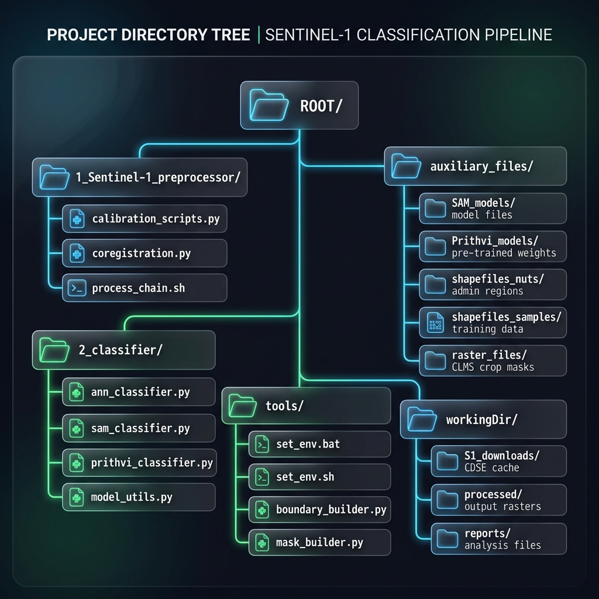
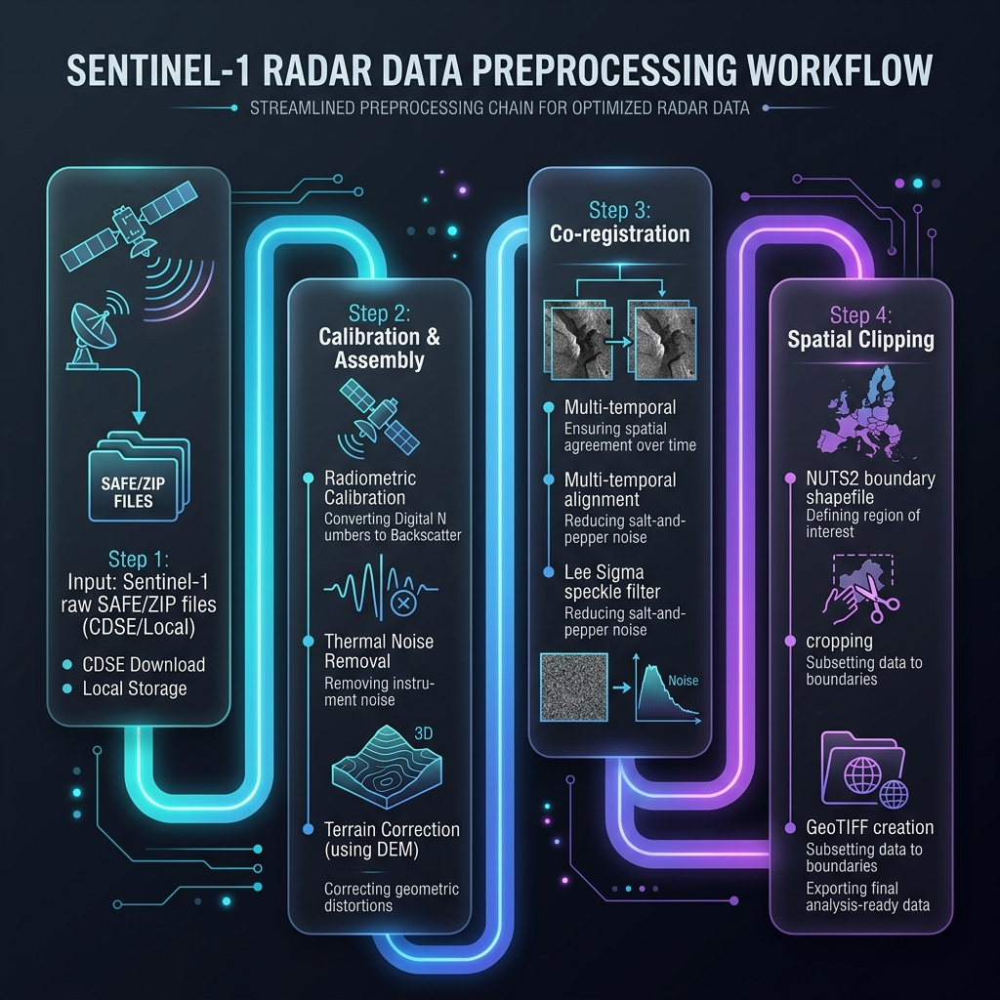
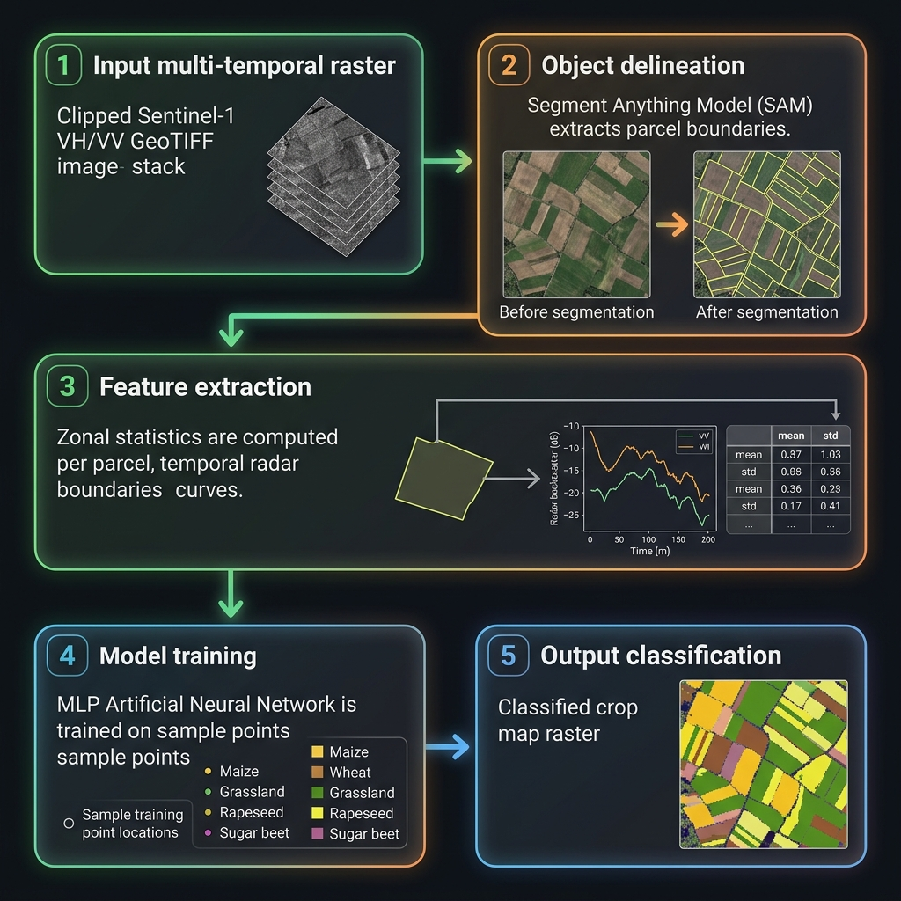
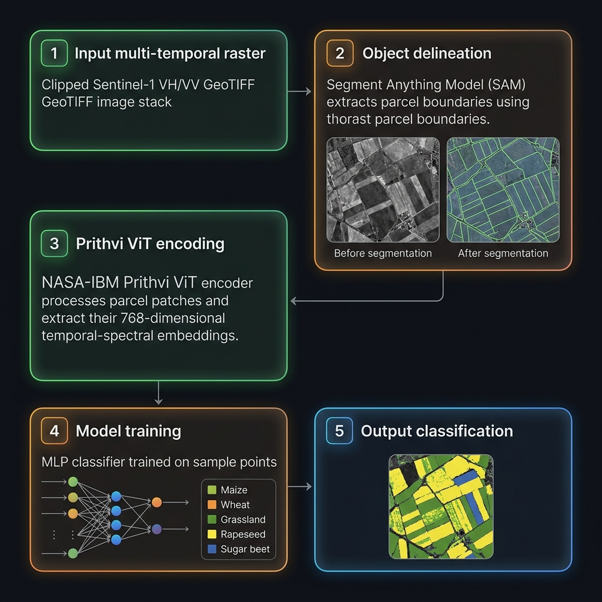

# Sentinel-1 OBIA crop type mapping pipeline (v2.0)

An automated, object-based image analysis (OBIA) pipeline designed to process Sentinel-1 SAR time series and perform crop type classification. It integrates state-of-the-art **Geospatial Foundation Models** and classical **machine learning classifiers** to handle large-scale country-wide cropland mapping.

### Key technologies and models:
1. **IBM-NASA Prithvi-EO-1.0-100M Foundation Model**: Used to extract deep, robust temporal-spectral embeddings from Sentinel-1 SAR stacks to represent agricultural fields.
2. **Meta AI Segment Anything Model (SAM)**: Used for precise deep-learning-based field boundary delineation (segmentation) under challenging backscatter conditions.
3. **Orfeo ToolBox (OTB) Classifier**: Integrates OTB's high-performance machine learning suite (Random Forest, Support Vector Machines - SVM) for lightning-fast training and pixel/object classification on large spatial grids.
4. **Multi-Layer Perceptron (MLP/ANN)**: A classical artificial neural network (scikit-learn and custom architectures) optimized for object-based class prediction.

This version (v2.0) introduces dynamic country-level orbit optimization (using the Set Cover algorithm), separate processing of Ascending/Descending tracks, and automatic country-wide classification merging.

---

## Table of contents
1. [Overview for non-experts](#overview-for-non-experts)
2. [Prerequisites and system installation](#prerequisites--system-installation)
   - [Windows setup](#windows-setup)
   - [Linux setup](#linux-setup)
3. [Environment configuration](#environment-configuration)
4. [Training samples specification (samples.shp)](#training-samples-specification-samplesshp)
5. [Interactive menu and stages selector (ANN / SAM)](#interactive-menu--stages-selector-ann--sam)
6. [Segment Anything (SAM) model setup and parameters](#segment-anything-sam-model-setup--parameters)
7. [NASA-IBM Prithvi-SAR model setup and parameters](#nasa-ibm-prithvi-sar-model-setup--parameters)
8. [Step-by-step execution guide](#step-by-step-execution-guide)
   - [Step 1: NUTS2 boundary database builder](#step-1-nuts2-boundary-database-builder)
   - [Step 2: Crop mask preparation](#step-2-crop-mask-preparation)
   - [Step 3: Sentinel-1 slice calibration and assembly](#step-3-sentinel-1-slice-calibration-and-assembly)
   - [Step 4: Multi-temporal stack coregistration](#step-4-multi-temporal-stack-coregistration)
   - [Step 5: Stack spatial clipping](#step-5-stack-spatial-clipping)
   - [Step 6: Object-based classification](#step-6-object-based-classification)
   - [Step 7: Classification merge](#step-7-classification-merge)
8. [Troubleshooting and performance tuning](#troubleshooting--performance-tuning)

---

## Overview for non-experts
Processing radar satellite data (Sentinel-1) usually involves many complicated manual steps. This toolbox automates the entire process:
1. **Calibration and slicing**: Converts raw radar backscatter signals (recorded as `.SAFE` directories) into physically meaningful values, merges slices of the same day, and clips them to your country's bounding box.
2. **Coregistration**: Aligns a time-series stack of images taken over several weeks/months so that pixels from different dates match perfectly.
3. **Segmentation and classification**: Groups similar pixels into "fields" (objects) using image segmentation, calculates stats (mean backscatter values over time), trains a machine learning model, and classifies what crop is growing in each field.

---

## Prerequisites and system installation

### Windows setup

1. **Install Python via Miniforge**:
   - Download and install [Miniforge3](https://github.com/conda-forge/miniforge) for Windows.
   - Open **Miniforge Prompt** and create your environment. 
     > [!TIP]
     > Miniforge uses `mamba` under the hood, which is significantly faster than the standard `conda` solver, especially on Windows when resolving complex geospatial dependencies like GDAL. We strongly recommend using the `mamba` command.
     > [!IMPORTANT]
     > The pipeline requires standard Python libraries for processing geospatial data, machine learning, and report generation:
     > - **Geospatial processing**: `gdal`, `geopandas`, `rasterio`, `numpy` (for grid manipulation), and `pyogrio` (for accelerated vector database reading).
     > - **Machine learning**: `scikit-learn` (for MLP ANN classifier).
     > - **Report and data handling**: `pandas`, `openpyxl` (for writing Excel metric reports), and `joblib` (for model saving/loading).
     > - **Image processing**: `scikit-image` (required for Felzenszwalb, SLIC, and Multi-Resolution segmentation).
     
     **If you do NOT have an NVIDIA GPU (Standard CPU Setup):**
     ```bash
     mamba env create -f environment.yml
     mamba activate aiml_env
     ```

     **If you have an NVIDIA GPU (Recommended for speed):**
     ```bash
     mamba env create -f environment_gpu.yml
     mamba activate aiml_env
     ```

2. **Install ESA SNAP**:
   - Download the SNAP installer from [ESA SNAP Download](https://step.esa.int/main/download/snap-download/).
   - Run the installer. You can install to the default path on drive `C:\` or choose another drive (e.g., `D:\Program Files\esa-snap`).
   - Locate the path to the executable `gpt.exe` (e.g. `D:\Program Files\esa-snap\bin\gpt.exe`). You will need to supply this exact path in the configuration.

3. **Install Orfeo ToolBox (OTB) (Optional)**:
   - Download OTB 6.2.0 Win64 and extract it to a local folder (e.g., `D:\AIML_CropMapper_Cloud\bin\OTB-6.2.0-Win64`).

---

### Linux setup

1. **Install System Dependencies (Ubuntu/Debian)**:
   ```bash
   sudo apt-get update
   sudo apt-get install -y gdal-bin libgdal-dev build-essential unzip
   ```

2. **Install Python Environment**:
   - Install Miniconda or Miniforge:
     ```bash
     wget https://github.com/conda-forge/miniforge/releases/latest/download/Miniforge3-Linux-x86_64.sh
     bash Miniforge3-Linux-x86_64.sh -b
     source ~/miniforge3/bin/activate
     ```
   - Create the environment using the provided YAML configuration files:
     
     **If you do NOT have an NVIDIA GPU (Standard CPU Setup):**
     ```bash
     mamba env create -f environment.yml
     mamba activate aiml_env
     ```

     **If you have an NVIDIA GPU (Recommended for speed):**
     ```bash
     mamba env create -f environment_gpu.yml
     mamba activate aiml_env
     ```

3. **Install ESA SNAP**:
   - Download the SNAP Linux installer `.sh` script from ESA's website.
   - Run the installer:
     ```bash
     chmod +x esa-snap_sentinel_unix_*.sh
     ./esa-snap_sentinel_unix_*.sh -q
     ```
   - Note the installation path (typically `/usr/local/esa-snap` or `$HOME/esa-snap`). Locate the `gpt` tool in the `bin/` directory.

---

## Environment configuration

Before running any script, you must configure the following environment variables in your terminal shell. Make sure all paths align with your actual system installation.

> [!TIP]
> Instead of exporting these variables manually every time you open a terminal, we recommend using the `set_env.bat` (Windows) or `set_env.sh` (Linux) scripts provided in the `tools/` folder. Adjust the paths inside these scripts to match your system and run them to automatically set your environment.

### On Windows (PowerShell):
```powershell
# Set the exact path to SNAP gpt.exe (change D: to C: if installed on drive C)
$env:SNAP_GPT_EXE="D:/Program Files/esa-snap/bin/gpt.exe"

# Path to SNAP auxiliary files (where orbit files are cached)
$env:SNAP_AUXDATA_PATH="C:/Users/Administrator/.snap/auxdata"

# Path to the raw Sentinel-1 GRD SAFE repository directory (for local preprocessor scripts)
$env:S1_REPO_PATH="Y:/Sentinel-1/SAR/IW_GRDH_1S"

# Output workspace directory for intermediate and final rasters
$env:AIML_WORKING_DIR="D:/AIML_CropMapper_Cloud/workingDir"

# Path to project's auxiliary files directory
$env:AIML_AUX_DIR="D:/AIML_CropMapper_Cloud/auxiliary_files"

# CDSE Credentials for remote downloader preprocessor (Optional)
$env:CDSE_USERNAME="your_username@email.com"
$env:CDSE_PASSWORD="your_password"
```

### On Linux (Bash):
```bash
# Set the exact path to SNAP gpt
export SNAP_GPT_EXE="/usr/local/esa-snap/bin/gpt"

# Path to SNAP auxiliary files (where orbit files are cached)
export SNAP_AUXDATA_PATH="$HOME/.snap/auxdata"

# Path to the raw Sentinel-1 GRD SAFE repository directory (for local preprocessor scripts)
export S1_REPO_PATH="/mnt/sentinel1/SAR/IW_GRDH_1S"

# Output workspace directory for intermediate and final rasters
export AIML_WORKING_DIR="/home/user/AIML_CropMapper_Cloud/workingDir"

# Path to project's auxiliary files directory
export AIML_AUX_DIR="/home/user/AIML_CropMapper_Cloud/auxiliary_files"

# CDSE Credentials for remote downloader preprocessor (Optional)
export CDSE_USERNAME="your_username@email.com"
export CDSE_PASSWORD="your_password"
```

---

## Training samples specification (samples.shp)

To train the machine learning classifier, you must supply a point vector dataset containing crop reference points.

### 1. File format and geometry
- **Format**: ESRI Shapefile or SQLite database.
- **Geometry Type**: **Point** (`OGRPoint`). Polygons are not supported; reference points should lie inside the fields.
- **Coordinate System (CRS)**: Any standard coordinate reference system (e.g. `EPSG:4326` or `EPSG:3857`). The pipeline automatically reprojects the points to match the raster coordinate system.

### 2. Required attribute fields
The shapefile attributes table **must** contain an integer column representing the crop classes:
- **`crop_id`** (Integer): Numeric code corresponding to the crop type or land-cover class.
  - *Note*: Positive values are parsed as training samples (e.g., `11` = Winter Wheat, `12` = Maize, `1430` = Rapeseed).
  - *Note*: Value `0` is reserved for background/ignored areas.

### 3. File directory hierarchy (input paths)
The classifier searches for your reference shapefile in the `shapefiles_samples` directory using the following hierarchy (matching the Python code search paths):
1. `auxiliary_files/shapefiles_samples/{FILE_PREFIX}/samples.shp` (e.g. `PL_orbit_12/samples.shp` or `AT_P1a/samples.shp`)
2. `auxiliary_files/shapefiles_samples/{SAN_TRACK}/samples.shp` (e.g. `PL_orbit_12/samples.shp` or `P1a/samples.shp`)
3. `auxiliary_files/shapefiles_samples/{TRACK}/samples.shp` (e.g. `PL/orbit_12/samples.shp` or `P1a/samples.shp`)
4. `auxiliary_files/shapefiles_samples/{COUNTRY}/samples.shp` (e.g. `PL/samples.shp` or `AT/samples.shp` - country fallback)
5. `auxiliary_files/shapefiles_samples/samples.shp` (global fallback)

### 4. Automatic sample splitting
In Stage 2, the pipeline automatically splits your `samples.shp` dataset:
- **70%** of the points are randomly selected and saved as `learn.shp` (for model training).
- **30%** of the points are saved as `control.shp` (for independent model validation and confusion matrix generation).

### 5. Crop Prior Probabilities (priors.json)
To apply prior probability correction (Bayesian priors correction) in Stage 5, the pipeline requires statistical crop proportions representing the real-world agricultural acreage of each crop in the target country.
- **Name-based Configuration**: Create a `priors.json` file inside `auxiliary_files/shapefiles_samples/{COUNTRY}/priors.json` or directly in the track directory. 
- **Mapping Mechanism**: Instead of hardcoding values by arbitrary `crop_id`, write names (e.g., `"grassland": 0.7214, "maize": 0.0847`). The pipeline automatically scans the reference shapefile attributes, extracts crop names, and pairs them with correct IDs at run-time.
- **Automatic Priors Generator**: You can generate a correct `priors.json` from a raw, unbalanced country-wide LPIS vector dataset by running:
  ```bash
  python tools/generate_priors_from_lpis.py --input "path/to/raw_lpis.shp" --output "auxiliary_files/shapefiles_samples/{COUNTRY}/priors.json" --crop_col crop_name
  ```

### 6. Dynamic Crop Aggregation (Netherlands NL)
To reduce semantic confusion (e.g. between Grassland, Clover, and Lucerne), the pipeline dynamically aggregates minor legume classes into the dominant grassland class:
- **Dynamic Matching**: If the country is `NL`, the script parses names in the shapefile attribute table. If a crop name contains keywords like `clover`, `klaver`, `lucerne`, or `luzerne`, it is dynamically mapped to the ID of the grassland class in that shapefile at run-time.
- **Robustness**: This avoids ID mismatches between different training datasets and prevents errors when calculating validation metrics.

---

## Interactive menu and stages selector (ANN-SAM)

When you execute the classifier script (`1_classify_ann.py`), the program starts an interactive text menu in your terminal. This gives you absolute control over execution, allowing you to run everything in one go or step-by-step while adjusting hyperparameters.

### The pipeline menu layout
Upon launching the script, the following menu is displayed:
```text
    --- Raster-Based OBIA Pipeline (ANN) ---
    Track: PL/orbit_12 (PL)

    [0] Stage 0: Generate Data Footprint Mask
    [1] Stage 1: SAR Segmentation (Meta SAM - Automatic Mask Generator)
    [2] Stage 2: Split Samples
    [3] Stage 3: Extract Features (Object-based Training)
    [4] Stage 4: Train ANN Classifier
    [5] Stage 5: Tiled Object-Based Inference
    [6] Stage 6: Mask Classification
    [7] Stage 7: Mask Confidence
    [8] Stage 8: Calculate Metrics

    [A] Run All Stages (Forces overwrite of Stages 5-8 to clear old bugs)
    [Q] Quit

    Enter your choice:
```

### Detailed execution options

#### Option `A`: Run all stages (all-in-one execution)
- Recommended for standard runs. 
- Automatically executes all 8 stages sequentially.
- Forces overwrite of the inference outputs (`Stage 5` to `8`) to ensure no corrupted files or caching issues are present.

#### Single-stage execution and parameter tuning
You can select individual numbers to execute specific parts of the pipeline and dynamically adjust their parameters:

- **Choice `1` (Stage 1: Segmentation)**:
  - Splitting the raster into homogenous segments.
  - You can change hyperparameters interactively when prompted (e.g. `scale`, `sigma`, `min_size` for Felzenszwalb, or Multi-Resolution Segmentation parameters).
  - Prompts:
    ```text
    Change parameters? (y/n) [n]: y
    Enter new value for 'scale' [50.0]: 40.0
    Enter new value for 'min_size' [15]: 20
    ```

- **Choice `2` (Stage 2: Split Samples)**:
  - Randomly partitions `samples.shp` into training and validation sets.
  - Prompts:
    ```text
    Change parameters? (y/n) [n]: y
    Enter new value for 'learn_frac' [0.7]: 0.8
    ```

- **Choice `3` (Stage 3: Extract Features)**:
  - Performs zonal statistics on the segments corresponding to training locations, storing outputs in a CSV file. No hyperparameters needed.

- **Choice `4` (Stage 4: Train ANN)**:
  - Trains the neural network on the extracted features.
  - Allows you to change classifier settings (e.g. MLP hidden layers architecture, max training iterations, or class balancing threshold).
  - Prompts:
    ```text
    Change parameters? (y/n) [n]: y
    Enter classifier (ann_sklearn) [ann_sklearn]: ann_sklearn
    Enter new value for 'sk_hidden_sizes' [100,50]: 120,60,30
    Enter new value for 'sk_max_iter' [500]: 800
    Enter new value for 'balance_threshold' [1000]: 1500
    ```

- **Choice `5` (Stage 5: Object-Based Inference)**:
  - Runs classification on every segment across the full raster tiles. This is performed block-by-block to prevent memory exhaustion (OOM).
  - **Pre-trained Model Fallback System**: Designed to handle fallback scenarios, such as boundary/fringe orbits covering only a small portion of the country's territory where local training data is insufficient or the local model file is missing. The inference stage automatically scans the country's subfolders and loads the "best" available pre-trained model for the active segmentation mode. Candidates are ranked by crop class completeness, geographic proximity (Euclidean distance between raster centers), training sample count, and Overall Accuracy. Bayesian priors are automatically updated to match the fallback model's training distribution.

- **Choice `6` and `7` (Stage 6 and 7: Cropland Masking)**:
  - Applies the binary agricultural mask (generated in Step 2) and data footprint to the final classification and confidence GeoTIFFs.

- **Choice `8` (Stage 8: Calculate Metrics)**:
  - Computes global Overall Accuracy, Kappa coefficient, per-class recall, precision, F1-score, and crop areas (in hectares). Generates the final Excel report.

---

## Segmentation methods and parameter tuning guide

Upon executing `Stage 1` (Segmentation) in the interactive menu of `1_classify_ann.py`, the program presents the following sub-menu to select your preferred segmentation method:

```text
=== SELECT SEGMENTATION METHOD ===
  Current method: PYTHON_SAM

  [1] Meta SAM (Deep learning, default) [python_sam]
  [2] OTB Mean-Shift on summed dB (Fast C++ engine) [otb_meanshift_summed]
  [3] Felzenszwalb algorithm on full raster [python_felzenszwalb]
  [4] SLIC algorithm on full raster [python_slic]
  [5] LPIS boundary rasterization (Cadastral vector data) [lpis]
  [Enter] Keep current method
Choose option (1-5): 
```

Selecting a method will also dynamically toggle the target outputs and paths between the cadastral boundaries (`_lpis` suffix) and dynamic segmentation results (`_sam` suffix).

### 1. Supported segmentation methods

* **Meta SAM (`python_sam` - default)**: Utilizes Meta AI's deep learning Segment Anything Model (SAM) to delineate agricultural field boundaries. It is highly robust to SAR speckle noise and understands general object shapes. Since SAM is trained on RGB imagery, the pipeline converts the SAR data to 8-bit, enhances contrast using CLAHE, and applies an edge-preserving bilateral filter before passing it to SAM-Geo. Requires downloading weights (see checkpoint instructions below).
* **OTB Mean-Shift on summed dB (`otb_meanshift_summed`)**: Integrates the high-performance C++ Mean-Shift clustering engine from Orfeo ToolBox. Fast and yields high-quality linear features, but OTB can suffer from disk I/O bottlenecks when writing large numbers of vector polygons to shapefiles.
* **Felzenszwalb (`python_felzenszwalb`)**: A graph-based CPU clustering algorithm. It is very fast but highly sensitive to local pixel-to-pixel variations, which can cause it to segment individual radar speckle patterns instead of actual agricultural fields.
* **SLIC (`python_slic`)**: Simple Linear Iterative Clustering. It partitions the image into compact, uniform-sized superpixel cells using k-means in the color-spatial space. Because it favors regular grid-like shapes, it does not conform well to actual irregular field boundaries.
* **LPIS boundary rasterization (`lpis`)**: Instead of dynamic image-based segmentation, this mode queries cadastral or land parcel vector databases (e.g., BRP in the Netherlands or ARiMR in Poland) stored in the country's sample directory. It reprojects the vector boundaries to match the target raster grid and rasterizes them by burning unique parcel identifiers into the segmentation raster. This is the gold standard for official statistical crop classification when vector databases are available.

---

### 2. Tuning parameters for each method

#### Meta SAM (`python_sam`)
SAM is deep learning-based and highly sensitive to GPU VRAM limits.
* **`sam_checkpoint`**: Absolute path to the downloaded `.pth` weights file (e.g. `sam_vit_h_4b8939.pth`).
* **`sam_model_type`**: The size/variant of the model. Choose `vit_b` (small, 375 MB, fast, uses ~2 GB VRAM, good for quick testing), `vit_l` (medium, 1.2 GB), or `vit_h` (huge, 2.4 GB, slow, uses ~10 GB VRAM, highest precision).
* **`sam_device`**: Execution hardware. Use `cuda` for NVIDIA GPU acceleration (highly recommended) or `cpu` (very slow) as a fallback.
* **`tile_size`**: Dimensions of the image blocks processed by SAM. Defaults to `2048`. Lower this to `1024` or `512` if you encounter CUDA out-of-memory (OOM) errors.
* **`buffer`**: Overlap buffer in pixels around each tile to prevent boundary edge artifacts. Defaults to `128`.
* **`points_per_side`**: Grid density of mask candidate probes. Increasing this (e.g., to `128` or `160`) allows the detection of smaller/finer fields but increases processing time and VRAM usage.
* **`pred_iou_thresh`**: Filter threshold for predicted mask IoU (Intersection-over-Union). Lowering this (e.g., to `0.45`) keeps more candidate masks (useful for small or fuzzy crop fields).
* **`stability_score_thresh`**: Filter threshold for mask stability under binary threshold perturbations. Lowering this to `0.45` allows more fields to be successfully segmented.
* **`min_mask_region_area`**: The minimum area (in pixels) for a segmented mask to be retained.

#### OTB Mean-Shift (`otb_meanshift_summed`)
* **`spatialr`**: Spatial radius of the neighborhood in pixels. Determines the maximum spatial distance between pixels to be merged.
* **`ranger`**: Spectral radius (backscatter similarity distance in dB). Controls how similar backscatter values must be to merge pixels.
* **`minsize`**: Minimum segment size in pixels. Merges any segments smaller than this value with their neighbor to clean up slivers.
* **`ram`**: RAM memory limit allocated to Orfeo ToolBox in MB.
* **`tilesizex` & `tilesizey`**: Tile dimensions for processing large raster files.

#### Felzenszwalb (`python_felzenszwalb`)
* **`scale`**: Controls the size of the generated segments (larger scale = larger segments).
* **`sigma`**: Width of the Gaussian smoothing pre-filter. Higher values smooth out radar speckle noise but blur parcel boundaries.
* **`min_size`**: Minimum segment size in pixels.
* **`tile_size` & `buffer`**: Processing block dimension (`4096`) and overlap boundary (`256`).

#### SLIC (`python_slic`)
* **`n_segments`**: The target number of superpixel segments to generate across each tile.
* **`compactness`**: Balances color proximity and space proximity. Higher values make superpixels more regularly shaped/grid-like (square), while lower values allow them to conform to irregular crop boundaries.
* **`slic_sigma`**: Width of Gaussian smoothing pre-filter to reduce speckle noise.
* **`tile_size` & `buffer`**: Processing block dimension (`4096`) and overlap boundary (`256`).

#### LPIS boundary rasterization (`lpis`)
* **No parameters**: This method relies entirely on official external cadastral GIS boundary vectors (`.gpkg` or `.shp`). It queries the intersecting parcels within the spatial footprint, reprojects them, and rasterizes them by burning their unique database primary key (FID / ID) as the pixel value.

---

### 3. Downloading SAM model weights
If you use the `python_sam` method:
1. Download the **ViT-H SAM model checkpoint** (`sam_vit_h_4b8939.pth`) from the official Facebook Research repository:
   [sam_vit_h_4b8939.pth (Download Link)](https://dl.fbaipublicfiles.com/segment_anything/sam_vit_h_4b8939.pth)
2. Create the directory `auxiliary_files/SAM_models/` (if it does not exist).
3. Save the downloaded `.pth` file directly as:
   `auxiliary_files/SAM_models/sam_vit_h_4b8939.pth`

---

## NASA-IBM Prithvi-SAR model setup and parameters

The Prithvi-SAR crop classifier (`1_classify_prithvi_sar.py`) utilizes the pre-trained NASA-IBM Prithvi-EO-1.0-100M geospatial foundation model for extracting deep temporal-spectral representations from multi-date Sentinel-1 SAR stacks.

### 1. Auto-download architecture
The script is designed to **automatically download** all required model components from the official HuggingFace repository (`ibm-nasa-geospatial/Prithvi-EO-1.0-100M`) on the first run:
- **Architecture definition**: `prithvi_mae.py` (downloaded and saved to `auxiliary_files/Prithvi_models/`)
- **Model weights**: `Prithvi_100M.pt` (downloaded and saved to `auxiliary_files/Prithvi_models/`)

If your processing machine lacks internet access, you can manually download these two files and place them inside the `auxiliary_files/Prithvi_models/` directory prior to running the script.

### 2. Temporal stacking logic
Prithvi expects 6 spectral bands across 3 temporal frames (total size `[6, 3, 224, 224]`). The script automatically:
1. Groups Sentinel-1 VV/VH bands into three seasonal frames (early, mid, and late season).
2. Duplicates the 2 polarization bands to construct the 6-band input expected by the model.
3. Resizes segment crops bilinearly to `224x224` pixels.
4. Feeds them to the Prithvi ViT encoder to extract a `768`-dimensional token embedding vector per segment.

---

### Step-by-step execution guide

This guide details each script in the pipeline, explaining its functionality, requirements, execution commands, and output products.

> [!IMPORTANT]
> **Working Directory**: All terminal commands listed below must be executed from the **root directory** of this repository (the folder containing this `README.md`). Do not navigate into subfolders like `1_Sentinel-1_preprocessor` to run the scripts, as this will break relative paths.
> 
> Also, ensure your conda environment is active before starting:
> ```bash
> mamba activate aiml_env
> ```

---

### Project directory structure

To set up a new project on a new computer, establish the following folder hierarchy (matching the structure automatically populated during the step-by-step pipeline execution):



---

### Step 1: NUTS2 boundary database builder
* **Description and Logic**: Automatically downloads the official GISCO Eurostat administrative boundary dataset (1:1 Million high-resolution shapefiles) and extracts boundary polygons for 37 European countries. It builds a local GIS database of national boundaries at the NUTS2 level, which is used for spatial subsetting of the satellite data. It also duplicates boundaries for Greece under both `EL` and `GR` codes to handle standardized data querying.
* **Prerequisites and Config**: Requires `geopandas` and `pyogrio` python packages. No environment variables are needed.
* **Launch Command**:
  ```bash
  python download_nuts_shapefiles.py
  ```
* **Produced Outputs**:
  - National boundary shapefiles saved to: `auxiliary_files/shapefiles_nuts/{COUNTRY}/NUTS2_{COUNTRY}.shp`

---

### Step 2: Crop mask preparation
* **Description and Logic**: Mosaics and clips the Copernicus High Resolution Layer (HRL) Crop Type raster files to the exact boundary of the target country. It aligns the final raster to the Web Mercator projection (`EPSG:3857`) at a 10-meter resolution grid. Non-agricultural pixels are masked out to focus object segmentation and neural network predictions strictly on active croplands.
* **Prerequisites and Config**: The HRL ZIP files must be manually downloaded from the Copernicus CLMS portal and placed in `auxiliary_files/raster_files/AgriMasks/{COUNTRY}/Results/` (e.g. `PL/Results/`).
* **Launch Command**:
  ```bash
  python tools/build_agri_mask.py --country PL
  ```
* **Produced Outputs**:
  - Arable Crops Mask (Cereals, Rape, Maize, Vegetables): `auxiliary_files/raster_files/AgriMasks/{COUNTRY}/{COUNTRY}_agri_mask_3class_epsg3857.tif`
  - All Crops Mask (Arable + Permanent Crops and Grasslands): `auxiliary_files/raster_files/AgriMasks/{COUNTRY}/{COUNTRY}_agri_mask_allcrops_epsg3857.tif`

---

### Sentinel-1 radar preprocessing workflow

Before running the classification pipeline, the Sentinel-1 SAR scenes are downloaded, calibrated, coregistered, and spatially clipped to target country boundaries:



---

### Step 3: Sentinel-1 slice calibration and assembly
* **Description and Logic**: Scans available Sentinel-1 spatial geometries and solves a Set Cover mathematical optimization problem (`CountryOrbitOptimizer` / `CDSECountryOrbitOptimizer`) to find the minimal set of relative orbits required to fully cover the country's geometry. For each orbit, it runs SNAP's Graph Processing Tool (`gpt.exe`) to perform calibration.
* **Calibration Alternatives**:
  - **Standard calibration (local Y: drive)** (`1a_slice_calibration.py`): Scans the local directory, performs radiometric calibration, orbit application, thermal noise removal, terrain correction, and slice assembly, saving intermediate and final outputs as raw SNAP `.dim` / `.data` BEAM-DIMAP pairs.
  - **Cloud-Optimized GeoTIFF (COG) calibration (local Y: drive)** (`1b_slice_calibration_cog.py` [**RECOMMENDED FOR LOCAL DISK**]): Executes the same calibration steps but writes outputs directly as Cloud-Optimized GeoTIFFs (`.tif`) utilizing DEFLATE compression. 
    > [!TIP]
    > **Why the COG version is preferred for local repositories:**
    > 1. **Massive Disk Space Savings**: Uses up to 5x less disk space compared to uncompressed raw BEAM-DIMAP files.
    > 2. **Cloud/Network Optimization**: Supports HTTP range requests, making it highly optimized for remote storage, virtual file systems, and cloud deployments.
    > 3. **Reduced I/O Bottlenecks**: Faster reading/writing during downstream coregistration and clipping steps.
  - **CDSE calibration and downloader (local server run)** (`1c_slice_calibration_cdse.py` [**FOR LOCAL RUNS WITHOUT CLOUD/Y: DRIVE**]): Designed for downloading and processing Sentinel-1 data on a local server or machine rather than using a cloud-mounted repository. It automatically **discovers, downloads, and extracts the required Sentinel-1 raw ZIP files directly from the Copernicus Data Space Ecosystem (CDSE)**. Raw S1 files are cached in `workingDir/S1_downloads` for future runs, while calibrated and assembled outputs are saved directly to the country and orbit directories (`workingDir/{COUNTRY}/orbit_{ORBIT}/slice_assembly/`).
* **Prerequisites and Config**: 
  - For local runs: Requires SNAP GPT executable path and environment variables (`SNAP_GPT_EXE`, `S1_REPO_PATH`, `AIML_WORKING_DIR`, `AIML_AUX_DIR`).
  - For CDSE downloader (`1c_slice_calibration_cdse.py`): Also requires `CDSE_USERNAME` and `CDSE_PASSWORD` environment variables set in your shell (e.g. by configuring them in `tools/set_env.bat` or `tools/set_env.sh`).
* **Launch Command**:
  ```bash
  # Standard Calibration (BEAM-DIMAP outputs from local repository):
  python 1_Sentinel-1_preprocessor/1a_slice_calibration.py -s 2024-10-15 -e 2024-11-30 -c PL

  # Cloud-Optimized GeoTIFF (COG) Calibration (Preferred local run):
  python 1_Sentinel-1_preprocessor/1b_slice_calibration_cog.py -s 2024-10-15 -e 2024-11-30 -c PL

  # Cloud-Optimized GeoTIFF (COG) Calibration for a single specific orbit (e.g., Orbit 161 for Netherlands):
  python 1_Sentinel-1_preprocessor/1b_slice_calibration_cog.py -s 2024-10-15 -e 2025-09-15 -c NL -o 161

  # Copernicus Data Space Ecosystem (CDSE) Calibration and Downloader:
  python 1_Sentinel-1_preprocessor/1c_slice_calibration_cdse.py -s 2024-10-15 -e 2024-11-30 -c PL
  ```
  *Command arguments:*
  - `-s` : Start date (`YYYY-MM-DD`)
  - `-e` : End date (`YYYY-MM-DD`)
  - `-c` : 2-letter NUTS0 country code (e.g. `PL` for Poland)
  - `-o` : (Optional) Specify a single relative orbit number (e.g. `161`) to process, bypassing the automatic orbit discovery and optimization stage.
  - `-d` : (Optional for CDSE) Custom download directory path to cache SAFE files. Defaults to `workingDir/S1_downloads`.

* **Produced Outputs**:
  - Calibrated daily SAR scenes saved in: `workingDir/{COUNTRY}/orbit_{ORBIT}/slice_assembly/` as `.dim` / `.data` pairs (or `.tif` for COG).
  - (For CDSE) Cached raw S1 products in `workingDir/S1_downloads/`.

---

### Step 4: Multi-temporal stack coregistration
* **Description and Logic**: Aligns the multi-temporal time-series of assembled Sentinel-1 scenes for each orbit. It dynamically parses the band ordering (VH/VV) from the `.dim` XML files, sorts the dates chronologically, and registers all dates to a common master scene. It then applies a multi-temporal Lee Sigma speckle filter to suppress radar noise while preserving field boundaries.
* **Prerequisites and Config**: Requires calibrated outputs from Step 3.
* **Launch Command**:
  ```bash
  python 1_Sentinel-1_preprocessor/2_coregistration.py -t PL/orbit_12 PL/orbit_88
  ```
  *Command arguments:*
  - `-t` : Space-separated list of tracks/orbits to process (format: `{COUNTRY}/orbit_{NUMBER}`).

* **Produced Outputs**:
  - Aligned time-series stack saved to: `workingDir/{COUNTRY}/orbit_{ORBIT}/coregistration/` (as `.dim` and `.data` folders).

---

### Step 5: Stack spatial clipping
* **Description and Logic**: Converts the coregistered time-series SNAP stacks into standard multiband GeoTIFF format and clips them to the exact NUTS2 country boundary shapefile. It executes warping and DEFLATE compression in parallel across all CPU cores (`NUM_THREADS=ALL_CPUS`) and automatically builds overview pyramids (`BuildOverviews`) for instant visual rendering in QGIS.
* **Prerequisites and Config**: Requires NUTS2 shapefiles (from Step 1) and coregistered stacks (from Step 4).
* **Launch Command**:
  ```bash
  python 1_Sentinel-1_preprocessor/3_stack_clip.py -t PL/orbit_12 PL/orbit_88
  ```
* **Produced Outputs**:
  - Clipped Multiband GeoTIFF: `workingDir/{COUNTRY}/orbit_{ORBIT}/processed_raster/{COUNTRY}_orbit_{ORBIT}_VH_VV.tif` (along with a `.vrt` header file).

---

### Step 6: Object-based classification
* **Description and logic**: Splits the clipped image stack into homogeneous agricultural parcel objects, extracts statistical or deep learning features for each object over the Sentinel-1 timeline, trains a machine learning or deep learning classifier, and performs tiled prediction across the entire track.
* **Algorithm options**:
  - **Option A (ANN / LPIS / Felzenszwalb / SLIC / OTB)** - `1_classify_ann.py`: The primary neural network classifier script. It supports 5 segmentation methods selectable interactively in the CLI or starting directly using `--seg_mode`:
    - **`--seg_mode sam`**: Employs Meta AI's Segment Anything Model (SAM) for deep learning-based boundary delineation (requires GPU / PyTorch).
    - **`--seg_mode lpis`**: Instantly rasterizes cadastral or land parcel vector databases (e.g. BRP in the Netherlands or ARiMR in Poland) placed in `auxiliary_files/shapefiles_samples/{COUNTRY}/` to use exact parcel boundaries as classification objects.
    - **`--seg_mode otb_meanshift`** / **`felzenszwalb`** / **`slic`**: Launches the pipeline pointing directly to the corresponding dynamic segmentation files.
    - *Note on Naming Suffixes*: Output files, models, and metrics will automatically update to use the selected suffix (e.g., `*_classified_slic.tif`), preventing file collisions and allowing side-by-side comparisons of different segmentations on the same track.

    *The object-based classification workflow using SAM is structured as follows:*

    

  - **Option B (Prithvi-SAR)** - `1_classify_prithvi_sar.py`: Leverages the NASA-IBM geospatial foundation model to extract `768`-dimensional temporal-spectral token embeddings from segmented image patches. It includes its own built-in Segment Anything Model (SAM) segmentation stage, making the entire pipeline completely self-contained.

    *The object-based classification workflow using Prithvi-SAR is structured as follows:*

    

  - **Option C (OTB RF/SVM)** - `1_classify_otb.py`: Integrates Orfeo ToolBox (OTB) CLI tools. Performs OTB Mean-Shift segmentation on the time-series stack, extracts statistical object features, trains an OTB Random Forest or SVM classifier, and outputs classified shapefiles and rasters.
* **Prerequisites and config**: Requires the clipped raster (from Step 5), training sample points at `auxiliary_files/shapefiles_samples/{COUNTRY}/samples.shp`, model checkpoints if running SAM/Prithvi, and OTB binary installation in `bin/OTB-6.2.0-Win64/` if running OTB classification.
* **Launch command**:
  ```bash
  # Run ANN classifier (with SAM segmentation):
  python 2_classifier/1_classify_ann.py --track PL/orbit_12 --seg_mode sam

  # Run ANN classifier (with LPIS vector boundaries):
  python 2_classifier/1_classify_ann.py --track PL/orbit_12 --seg_mode lpis

  # Run ANN classifier (with SLIC segmentation):
  python 2_classifier/1_classify_ann.py --track PL/orbit_12 --seg_mode slic

  # Run ANN classifier (with Felzenszwalb segmentation):
  python 2_classifier/1_classify_ann.py --track PL/orbit_12 --seg_mode felzenszwalb

  # Run ANN classifier (with OTB Mean-Shift segmentation):
  python 2_classifier/1_classify_ann.py --track PL/orbit_12 --seg_mode otb_meanshift

  # Run NASA-IBM Prithvi-SAR Classifier:
  python 2_classifier/1_classify_prithvi_sar.py --track PL/orbit_12

  # Run OTB Random Forest/SVM Classifier:
  python 2_classifier/1_classify_otb.py --track PL/orbit_12
  ```

* **Running the Entire Pipeline (Option A)**:
  To run the entire pipeline (all stages 0-8) sequentially for a specific segmentation method (e.g. SLIC):
  1. Start the script with the desired `--seg_mode` option:
     `python 2_classifier/1_classify_ann.py --track NL/orbit_88 --seg_mode slic --mask_variant allcrops`
  2. Select option `[A] Run All Stages` in the interactive console menu. This will execute the entire footprint, segmentation, split, features, ANN, inference, and metric calculations automatically.
* **Produced Outputs**:
  - Segmentation Map: `workingDir/{track}/classification_results/segmentation/{file_prefix}_segmentation_{suffix}.tif`
  - Training/Validation Split Points: `.../samples/learn_{suffix}.shp` and `.../samples/control_{suffix}.shp`
  - Extracted Features: `.../samples/{file_prefix}_learn_features_{suffix}.csv`
  - Trained Classifier: `.../train_model/{file_prefix}_model_{suffix}.pkl`
  - Raw Outputs: `.../classification/{file_prefix}_classified_{suffix}.tif` and `..._confidence_map_{suffix}.tif`
  - Masked Outputs: `.../classification/{file_prefix}_classified_masked_{suffix}.tif` and `..._confidence_masked_{suffix}.tif`
  - Classification Accuracy Report: `.../classification/{file_prefix}_metrics_{suffix}.xlsx`

---

### Step 7: Classification merge
* **Description and Logic**: Mosaics and merges the classification results from all individual orbits into a single country-wide map. For overlapping zones between different orbits, the script compares confidence scores at the pixel level and selects the prediction with the **highest confidence score**. Finally, it applies a morphological **sieve filter** to dissolve small isolated pixels (slivers) and validates the merged dataset against validation points (`control.shp`).
* **Prerequisites and Config**: Requires masked rasters and `control.shp` from Step 6.
* **Launch Command**:
  ```bash
  # Merge standard ANN classifications (Felzenszwalb / SAM):
  python 2_classifier/2_merge_classifications.py --track PL

  # Merge Prithvi-SAR classifications:
  python 2_classifier/2_merge_classifications.py --track PL --suffix _prithvi
  ```
* **Produced Outputs**:
  - Merged Classification Raster: `workingDir/{COUNTRY}/classification_results/{COUNTRY}_final_classification[_prithvi].tif`
  - Country Accuracy Report: `workingDir/{COUNTRY}/classification_results/{COUNTRY}_final_metrics[_prithvi].xlsx`

---

## Troubleshooting and performance tuning

### SNAP memory and cache issues (OOM)
SNAP can consume huge amounts of RAM. If you face Java Heap Space/OOM crashes:
1. Locate SNAP's config: `gpt.vmoptions` (located in the SNAP `bin/` directory).
2. Edit the VM options (e.g. increase `-Xmx` memory threshold):
   ```text
   -Xmx16G
   -Dsnap.userdir=...
   ```
3. The scripts pass `-q 4` to GPT to limit it to 4 parallel threads. You can decrease this to `-q 2` in the scripts (`run_calibration_stage`, etc.) if memory usage is still too high.

### Orbit files download failures
During step 3/4, SNAP will attempt to download Precise Orbit files. If this fails due to ESA server downtimes:
- Ensure you have an internet connection.
- In SNAP's `Apply-Orbit-File` XML node, the code sets `continueOnFail` to `true`, which allows processing to continue with lower precision orbit files if the precise files are unavailable.

---

## How to cite

If you use this software in your research, publications, reports, or any derivative work, you are required under the Apache 2.0 license terms to acknowledge and cite the authors.

**APA Format:**
> Slesinski, P., Kotulak, N., Roos, M., Mróz, M., Mleczko, M., Gabriel, C., Hofer, N., Belton, S., Logakrishnan, M., Kästenbauer, M., Martins, C., Pallister, I. L. M., Gonçalves, I. (2025). Sentinel-1 OBIA Crop Type Mapping Pipeline (v2.0). [AIML4OS – One Stop Shop for Artificial Intelligence in Official Statistics](https://cros.ec.europa.eu/dashboard/aiml4os). European Commission / Eurostat. Available at: https://github.com/AIML4OS/WP7-Crop-type-mapping

**BibTeX:**
```bibtex
@software{slesinski2025obia,
  author       = {Slesinski, Przemyslaw and Kotulak, Natalia and Roos, Marko and Mróz, Marek and Mleczko, Magdalena and Gabriel, Cristina and Hofer, Nina and Belton, Sam and Logakrishnan, Mohana and Kästenbauer, Mathias and Martins, Carla and Pallister, Ivana I. L. M. and Gonçalves, Isabel},
  title        = {Sentinel-1 OBIA Crop Type Mapping Pipeline},
  version      = {2.0.0},
  year         = {2025},
  url          = {https://github.com/AIML4OS/WP7-Crop-type-mapping},
  organization = {AIML4OS – One Stop Shop for Artificial Intelligence in Official Statistics (https://cros.ec.europa.eu/dashboard/aiml4os), Eurostat, European Commission}
}
```

For more detailed citation metadata, please refer to the [`CITATION.cff`](CITATION.cff) file included in this repository.
